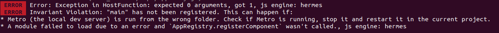

# How to reproduce the bug

- In terminal, run `npm start`.
- Launch the app from Expo Go.

The following errors appear in terminal:



If the below line (line 6) from 'App.tsx' is commented out, the app will not crash:
```
const Drawer = createDrawerNavigator()
```

## About the App

This app has the bare minimum code to reproduce the bug: just a homepage and no functionality.

It app was created with:
```
npx create-expo-app -t drawer-test
```
"@react-navigation/drawer" and "@react-navigation/native" where installed with expo:
```
npx expo install @react-navigation/drawer @react-navigation/native
```
